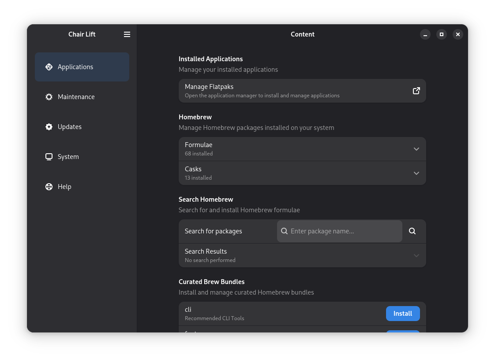

<div align="center">
    
    <h1>ChairLift</h1>
    <p>A modern system management tool for <a href="https://github.com/frostyard/snow">Snow Linux</a></p>
    <p>Manage your Homebrew packages, monitor system health, and maintain your system with ease.</p>
</div>

---

## Screenshots



---

## Features

### 📦 Homebrew Package Management

- **View Installed Packages**: Browse all installed formulae and casks in organized expandable lists
- **Search & Install**: Search the Homebrew repository and install packages with one click
- **Update & Upgrade**: Keep Homebrew up-to-date and upgrade outdated packages individually
- **Pin Packages**: Pin packages to prevent accidental upgrades
- **Curated Bundles**: Install pre-configured package bundles for common use cases

### 🏥 System Health Monitoring

- **System Performance**: Quick access to Mission Center for detailed system monitoring
- **Health Overview**: Check system diagnostics and health status

### 🔧 Updates & Maintenance

- **Homebrew Updates**: Check for and install package updates
- **Outdated Packages**: View and upgrade packages that have newer versions available
- **System Maintenance**: Keep your system running smoothly

---

## Installation

### Building from Source

ChairLift uses the Meson build system:

```bash
# Clone the repository
git clone https://github.com/frostyard/chairlift.git
cd chairlift

# Build and install
meson setup build
meson compile -C build
sudo meson install -C build
```

### Dependencies

- Python 3.x
- PyYAML (python3-yaml)
- GTK4
- libadwaita
- Homebrew (for package management features)
- Mission Center (optional, for system performance monitoring)

---

## Usage

Launch ChairLift from your application menu or run:

```bash
chairlift
```

### Main Sections

1. **System**: Monitor system health and performance
2. **Updates**: Manage Homebrew updates and outdated packages
3. **Applications**: View installed packages, search for new ones, and install curated bundles
4. **Maintenance**: System maintenance tools (coming soon)
5. **Help**: Documentation and support resources (coming soon)

### Managing Packages

- **Browse Installed**: Navigate to Applications → Brew Packages to see all installed formulae and casks
- **Search**: Use the search box to find packages by name or keyword
- **Install**: Click the install button next to search results or bundle items
- **Pin/Unpin**: Click the pin icon to lock/unlock a package version
- **Remove**: Click the trash icon to uninstall a package
- **Upgrade**: Click upgrade button next to outdated packages

### Bundle Installation

ChairLift supports installing curated package bundles (Brewfiles) located in `/usr/share/snow/bundles`. Each bundle is a pre-configured set of packages for specific use cases.

---

## Configuration

ChairLift is highly configurable and can be adapted for different Linux distributions. The application uses a YAML configuration file to control which features are displayed and which applications are launched for various system management tasks.

### Making ChairLift Portable

While ChairLift was designed for Snow Linux, it can be easily customized for other distributions by:

- **Disabling Snow-specific features**: Hide Homebrew package management if your distribution doesn't use it
- **Customizing system tools**: Configure which applications to launch for system monitoring, Flatpak management, etc.
- **Setting help resources**: Point users to your distribution's documentation, issue tracker, and community chat

### Configuration File

See [CONFIG.md](CONFIG.md) for detailed documentation on:

- Available configuration options
- How to show/hide specific feature groups
- Customizing application launchers
- Setting up help resource URLs
- Example configurations for non-Snow distributions

Configuration files are searched in the following locations (in order):

1. `/etc/chairlift/config.yml` (system-wide - highest priority)
2. `/usr/share/chairlift/config.yml` (package maintainer defaults)
3. `chairlift/config.yml` (development/source directory)

---

## Development

### Project Structure

```
chairlift/
├── chairlift/           # Main application code
│   ├── core/           # Core functionality (homebrew.py)
│   ├── views/          # UI views (user_home.py)
│   ├── gtk/            # GTK UI templates
│   └── assets/         # Application assets
├── data/               # Desktop files and icons
├── po/                 # Translation files
└── meson.build         # Build configuration
```

### Key Components

- **chairlift/core/homebrew.py**: Python library for Homebrew integration

  - Package listing and searching
  - Installation and removal
  - Pin/unpin functionality
  - Bundle management
  - Update and upgrade operations

- **chairlift/views/user_home.py**: Main UI implementation
  - GTK4/Adwaita interface
  - Async operations with threading
  - Toast notifications for user feedback

### Development Environment

ChairLift includes a preconfigured development environment using Distrobox and Just for easy setup:

#### Using Just

[Just](https://github.com/casey/just) is a command runner that provides convenient shortcuts for common development tasks. Available commands:

```bash
just setup    # Create and configure the distrobox development container
just enter    # Enter the development container
just build    # Build the project with meson
just local    # Build and install to ./install directory
just run      # Run the application in development mode
just clean    # Clean build artifacts
just pot      # Generate translation template
```

#### Using Distrobox

The project includes a `distrobox.ini` configuration that sets up a Debian Trixie container with all required dependencies. This ensures a consistent development environment across different host systems.

To get started:

```bash
# Create the development container
just setup

# Enter the container
just enter

# Inside the container, build and run
just build
just run
```

The distrobox configuration automatically mounts:

- `/home/linuxbrew` - for Homebrew integration testing
- `/usr/share/snow/bundles` - for bundle management testing

### Contributing

Contributions are welcome! Please feel free to submit issues and pull requests.

---

## Credits

ChairLift is adapted from [Vanilla OS First Setup](https://github.com/Vanilla-OS/first-setup).

### License

This program is free software: you can redistribute it and/or modify it under the terms of the GNU General Public License as published by the Free Software Foundation, version 3.

See [LICENSE](LICENSE) for details.

---

<div align="center">
    <p>Made with ❤️ for Snow Linux</p>
</div>
