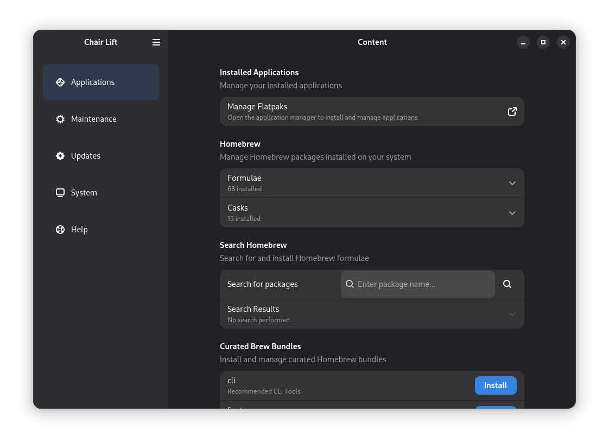

<div align="center">
    
    <h1>ChairLift</h1>
    <p>A modern system management tool for <a href="https://github.com/frostyard/snow">Snow Linux</a></p>
    <p>Manage your Homebrew packages, monitor system health, and maintain your system with ease.</p>
</div>

---

## Screenshots



---

## Features

### 📦 Homebrew Package Management

- **View Installed Packages**: Browse all installed formulae and casks in organized expandable lists
- **Search & Install**: Search the Homebrew repository and install packages with one click
- **Update & Upgrade**: Keep Homebrew up-to-date and upgrade outdated packages individually
- **Pin Packages**: Pin packages to prevent accidental upgrades
- **Curated Bundles**: Install pre-configured package bundles for common use cases
- **Tap Trust Management**: Homebrew 6's per-tap trust model hides packages installed from untrusted taps; ChairLift detects them and lets you trust a tap (and resume its updates) with one click, without requiring root

### 🏥 System Health Monitoring

- **System Performance**: Quick access to Mission Center for detailed system monitoring
- **Health Overview**: Check system diagnostics and health status

### 🔧 Updates & Maintenance

- **System Updates**: On bootc-based systems, download and stage the next OS image update (applied on restart) and view booted/staged/rollback deployment status
- **Homebrew Updates**: Check for and install package updates
- **Outdated Packages**: View and upgrade packages that have newer versions available
- **System Maintenance**: Keep your system running smoothly

---

## Installation

### Building from Source

ChairLift is written in Go using [puregotk](https://codeberg.org/puregotk/puregotk) bindings (no CGO required):

```bash
# Clone the repository
git clone https://github.com/frostyard/chairlift.git
cd chairlift

# Build
make build

# Binaries are written to build/:
#   build/chairlift                 the main application
#   build/chairlift-updex-helper    privileged helper for updex feature writes

# Install (binaries, polkit policies, icons, desktop file)
sudo make install
```

Other useful targets: `make dev` (CGO-enabled build with `-race` for development), `make fmt`, `make lint`, `make build-linux-amd64` / `make build-linux-arm64` (cross-compilation), `make uninstall`.

### Dependencies

- Go (see `go.mod` for the toolchain version)
- GTK 4 and libadwaita 1 (shared libraries, loaded at runtime by puregotk — no GTK dev headers or CGO needed to build)
- Homebrew (optional, for package management features and tap trust)
- Flatpak (optional)
- Snap/snapd (optional)
- `bootc` and the snow `/usr/libexec/bootc-update-stage` script (optional; enables staged system updates)
- `updex` features configured on the system (optional; toggled via the Features page)
- Mission Center (optional, for system performance monitoring)

---

## Usage

Launch ChairLift from your application menu or run:

```bash
chairlift
```

### Main Sections

1. **System**: Monitor system health and performance
2. **Updates**: Stage bootc system updates, manage Homebrew updates and outdated packages, apply Flatpak updates, and trust Homebrew taps
3. **Applications**: View installed packages, search for new ones, and install curated bundles
4. **Maintenance**: System cleanup and maintenance tools (Homebrew, Flatpak, custom scripts)
5. **Help**: Documentation and support resources (coming soon)

### Managing Packages

- **Browse Installed**: Navigate to Applications → Brew Packages to see all installed formulae and casks
- **Search**: Use the search box to find packages by name or keyword
- **Install**: Click the install button next to search results or bundle items
- **Pin/Unpin**: Click the pin icon to lock/unlock a package version
- **Remove**: Click the trash icon to uninstall a package
- **Upgrade**: Click upgrade button next to outdated packages

### Bundle Installation

ChairLift supports installing curated package bundles (Brewfiles) located in `/usr/share/snow/bundles`. Each bundle is a pre-configured set of packages for specific use cases.

---

## Configuration

ChairLift is highly configurable and can be adapted for different Linux distributions. The application uses a YAML configuration file to control which features are displayed and which applications are launched for various system management tasks.

### Making ChairLift Portable

While ChairLift was designed for Snow Linux, it can be easily customized for other distributions by:

- **Disabling Snow-specific features**: Hide Homebrew package management if your distribution doesn't use it
- **Customizing system tools**: Configure which applications to launch for system monitoring, Flatpak management, etc.
- **Setting help resources**: Point users to your distribution's documentation, issue tracker, and community chat

### Configuration File

See [CONFIG.md](CONFIG.md) for detailed documentation on:

- Available configuration options
- How to show/hide specific feature groups
- Customizing application launchers
- Setting up help resource URLs
- Example configurations for non-Snow distributions

Configuration files are searched in the following locations (in order):

1. `/etc/chairlift/config.yml` (system-wide - highest priority)
2. `/usr/share/chairlift/config.yml` (package maintainer defaults)
3. `chairlift/config.yml` (development/source directory)

---

## Development

### Project Structure

```
chairlift/
├── cmd/
│   ├── chairlift/               # Main application entry point
│   └── chairlift-updex-helper/  # Privileged helper for updex writes (invoked via pkexec)
├── internal/
│   ├── app/       # GObject-registered Application (adw.Application subtype)
│   ├── window/    # Main window: NavigationSplitView, sidebar, content stack
│   ├── views/     # Page builders and event handlers (one file per page)
│   ├── config/    # YAML config loading, feature group enablement
│   ├── homebrew/  # Homebrew CLI wrapper (incl. tap trust)
│   ├── flatpak/   # Flatpak CLI wrapper
│   ├── bootc/     # bootc wrapper (status reads, pkexec stage script)
│   ├── snap/      # Snap wrapper (snapd REST API)
│   ├── updex/     # Updex feature manager
│   └── version/   # Build metadata (ldflags injection)
├── data/          # Desktop file, icons, polkit policies/rules
└── Makefile       # Build configuration
```

### Key Components

See [yeti/OVERVIEW.md](yeti/OVERVIEW.md) and [yeti/package-managers.md](yeti/package-managers.md) for detailed architecture notes (written for AI-assisted development, but equally useful as a deep-dive for humans).

- **`internal/homebrew`**: Homebrew CLI wrapper — package listing/searching, install/uninstall, pin/unpin, bundles, updates, and Homebrew 6 tap-trust detection/management
- **`internal/bootc`**: bootc status reads and pkexec-driven update staging via the snow `bootc-update-stage` script
- **`internal/views`**: GTK4/Adwaita UI — async operations dispatched via `sgtk.RunOnMainThread`, toast notifications for user feedback

### Development Environment

- **Build**: `make build` (see [Building from Source](#building-from-source) above)
- **Containerized dev environment**: `distrobox.ini` describes a Debian Trixie container with the runtime and build dependencies; use `distrobox assemble create --file distrobox.ini` (or your preferred distrobox workflow) to create it, then `distrobox enter chairlift` and run `make build`/`make dev` inside. It mounts `/home/linuxbrew` (for Homebrew integration testing) and `/usr/share/snow/bundles` (for bundle management testing) from the host.

### Contributing

Contributions are welcome! Please feel free to submit issues and pull requests.

---

## Credits

ChairLift is adapted from [Vanilla OS First Setup](https://github.com/Vanilla-OS/first-setup).

### License

This program is free software: you can redistribute it and/or modify it under the terms of the GNU General Public License as published by the Free Software Foundation, version 3.

See [LICENSE](LICENSE) for details.

---

<div align="center">
    <p>Made with ❤️ for Snow Linux</p>
</div>
