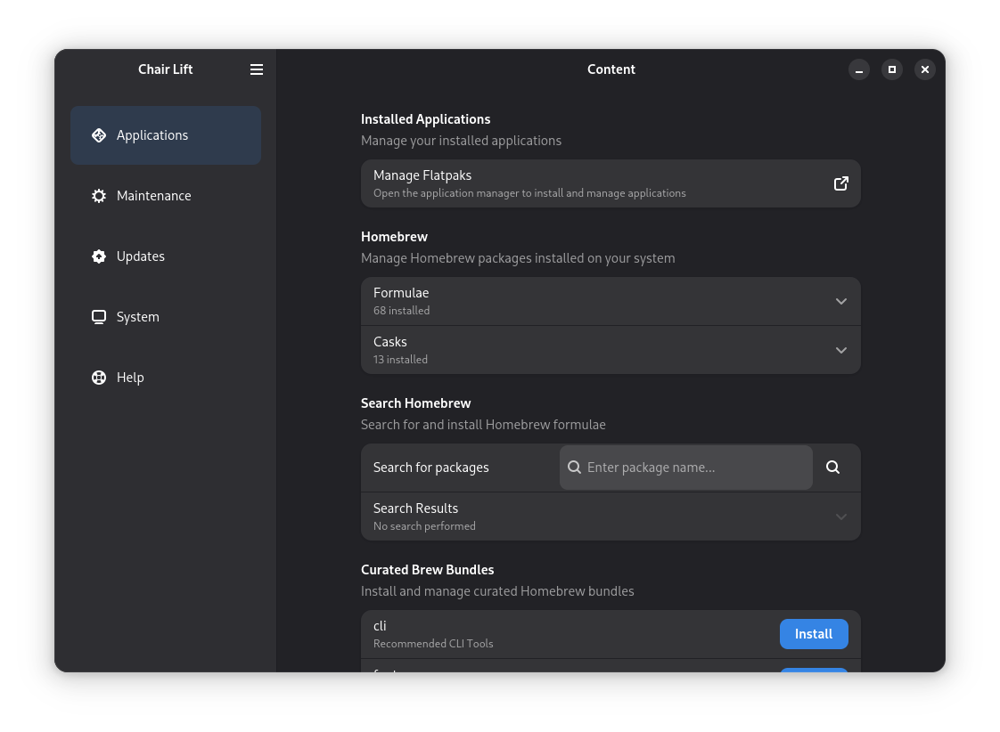

<div align="center">
    
    <h1>ChairLift</h1>
    <p>A modern system management tool for <a href="https://github.com/frostyard/snow">Snow Linux</a></p>
    <p>Manage your Homebrew packages, monitor system health, and maintain your system with ease.</p>
</div>

---

## Screenshots



---

## Features

### 📦 Homebrew Package Management

- **View Installed Packages**: Browse all installed formulae and casks in organized expandable lists
- **Search & Install**: Search the Homebrew repository and install packages with one click
- **Update & Upgrade**: Keep Homebrew up-to-date and upgrade outdated packages individually
- **Pin Packages**: Pin packages to prevent accidental upgrades
- **Curated Bundles**: Install pre-configured package bundles for common use cases
- **Tap Trust Management**: Homebrew 6's per-tap trust model hides packages installed from untrusted taps; ChairLift detects them and lets you trust a tap (and resume its updates) with one click, without requiring root

### 🏥 System Health Monitoring

- **System Performance**: Quick access to Mission Center for detailed system monitoring
- **Health Overview**: Check system diagnostics and health status

### 🔧 Updates & Maintenance

- **System Updates**: On bootc-based systems, download and stage the next OS image update (applied on restart) and view booted/staged/rollback deployment status
- **Homebrew Updates**: Check for and install package updates; actions show
  progress, reject repeated clicks, and refresh the outdated rows and sidebar
  badge after successful live operations
- **Outdated Packages**: View and upgrade packages that have newer versions available
- **System Maintenance**: Keep your system running smoothly

---

## Installation

### Building from Source

ChairLift is written in Go using [puregotk](https://codeberg.org/puregotk/puregotk) bindings (no CGO required):

```bash
# Clone the repository
git clone https://github.com/frostyard/chairlift.git
cd chairlift

# Build
make build

# Binaries are written to build/:
#   build/chairlift                 the main application
#   build/chairlift-updex-helper    privileged helper for updex feature writes

# Install (binaries, polkit policies, icons, desktop file)
sudo make install
```

`/usr` is the **only** supported `PREFIX` for an installation that
participates in PolicyKit authentication (`sudo make install` uses it by
default — no need to pass `PREFIX` explicitly). PolicyKit's `polkitd` reads
`.policy`/`.rules` files only from the fixed system directories
`/usr/share/polkit-1/actions` and `/usr/share/polkit-1/rules.d`, and `pkexec`
matches the updex helper it's asked to run against the absolute path
`/usr/bin/chairlift-updex-helper` recorded in
`data/org.frostyard.ChairLift.updex.policy`'s
`org.freedesktop.policykit.exec.path` annotation. Installing under any other
prefix places those files where polkit never looks, so the privileged
updex and bootc-staging features silently stop working (or fall back to a
more restrictive, always-reprompting authentication rule). This also matches
the layout used by ChairLift's own `.goreleaser.yaml` packages, so a source
install and a packaged install end up identical.

Both paths install package-maintainer configuration defaults at
`/usr/share/chairlift/config.yml`. They never create or overwrite the
administrator-owned `/etc/chairlift/config.yml` override.

`PREFIX` can still be overridden (e.g. `make install PREFIX=$HOME/.local`)
for a non-privileged, non-PolicyKit-integrated install — but the updex
helper and bootc staging will not resolve to the fixed exec-path annotation
in that case.

`DESTDIR` layers underneath `PREFIX` as usual, unchanged by any of the
above, for staged/packaged installs (`make install DESTDIR=/path/to/stage
PREFIX=/usr`) — this is what `.goreleaser.yaml`'s nFPM packaging uses.

**Migrating from a prior `/usr/local` source install:** `PREFIX` used to
default to `/usr/local`. Before reinstalling at the new `/usr` default,
remove the old install with `sudo make uninstall PREFIX=/usr/local`.

Other useful targets: `make dev` (CGO-enabled build with `-race` for development), `make fmt`, `make lint`, `make build-linux-amd64` / `make build-linux-arm64` (cross-compilation), `make uninstall`.

### Dependencies

- Go (see `go.mod` for the toolchain version)
- GTK 4 and libadwaita 1 (shared libraries, loaded at runtime by puregotk — no GTK dev headers or CGO needed to build)
- Homebrew (optional, for package management features and tap trust)
- Flatpak (optional)
- `bootc` and the snow `/usr/libexec/bootc-update-stage` script (optional; enables staged system updates)
- `updex` features configured on the system (optional; toggled via the Features page)
- Mission Center (optional, for system performance monitoring)

---

## Usage

Launch ChairLift from your application menu or run:

```bash
chairlift
```

### Main Sections

1. **Applications**: View installed packages, search for new ones, and install curated bundles
2. **Maintenance**: System cleanup and maintenance tools (Homebrew, Flatpak, custom scripts)
3. **Updates**: Stage bootc system updates, manage Homebrew updates and outdated packages, apply Flatpak updates, and trust Homebrew taps
4. **System**: Monitor deployment, health, and performance information
5. **Features**: Enable, disable, and update configured system features
6. **Help**: Documentation and support resources

### Keyboard Shortcuts

- `Alt+1` through `Alt+N`: open the first through Nth visible page in sidebar
  order. Pages whose configurable groups are all disabled are omitted, so the
  numbers compact without gaps; Help is always retained.
- `F1`: open Help
- `Ctrl+?`: show the keyboard-shortcuts window
- `Ctrl+Q`: quit

Mouse and keyboard navigation have identical behavior in a collapsed window:
selecting a destination reveals its content as well as updating the selected
sidebar row and page title.

### Managing Packages

- **Browse Installed**: Navigate to Applications → Brew Packages to see all installed formulae and casks
- **Search**: Use the search box to find packages by name or keyword
- **Install**: Click the install button next to search results or bundle items
- **Pin/Unpin**: Click the pin icon to lock/unlock a package version
- **Remove**: Click the trash icon to uninstall a package
- **Upgrade**: Click upgrade button next to outdated packages

### Bundle Installation

The Applications page discovers curated `*.Brewfile` bundles from every
directory configured in `applications_page.brew_bundles_group.bundles_paths`
(`/usr/share/snow/bundles` by default). Each bundle row shows its source path
and an Install action; a leading comment in the Brewfile becomes its
description. Missing directories are harmless, while unreadable configured
paths are reported without hiding bundles found elsewhere. Repeated clicks
cannot start overlapping installs, and `--dry-run` shows a preview without
leaving the row marked as installed.

---

## Configuration

ChairLift is highly configurable and can be adapted for different Linux distributions. The application uses a YAML configuration file to control which features are displayed and which applications are launched for various system management tasks.

### Making ChairLift Portable

While ChairLift was designed for Snow Linux, it can be easily customized for other distributions by:

- **Disabling Snow-specific features**: Hide Homebrew package management if your distribution doesn't use it
- **Customizing system tools**: Configure which applications to launch for system monitoring, Flatpak management, etc.
- **Setting help resources**: Point users to your distribution's documentation, issue tracker, and community chat

### Configuration File

See [CONFIG.md](CONFIG.md) for detailed documentation on:

- Available configuration options
- How to show/hide specific feature groups
- Customizing application launchers
- Setting up help resource URLs
- Example configurations for non-Snow distributions

Configuration files are searched in the following locations (in order):

1. `/etc/chairlift/config.yml` (system-wide - highest priority)
2. `/usr/share/chairlift/config.yml` (package maintainer defaults)
3. `config.yml` beside the ChairLift executable, or in the current working
   directory when no executable-relative file exists (development fallback)

The first file that exists is authoritative. If it is unreadable, malformed,
or contains unknown pages, groups, fields, or invalid field types, ChairLift
does not use a lower-priority file: it hides every configurable feature group,
logs a `CONFIGURATION ERROR`, and shows a persistent error toast with the path
and cause. Fix the file and restart ChairLift. If every candidate is absent,
the built-in defaults apply.

---

## Development

### Project Structure

```
chairlift/
├── cmd/
│   ├── chairlift/               # Main application entry point
│   └── chairlift-updex-helper/  # Privileged helper for updex writes (invoked via pkexec)
├── internal/
│   ├── app/       # GObject-registered Application (adw.Application subtype)
│   ├── window/    # Main window: NavigationSplitView, sidebar, content stack
│   ├── navigation/ # Canonical pages, shortcuts, and headless transition logic
│   ├── views/     # Page builders and event handlers (one file per page)
│   ├── config/    # YAML config loading, feature group enablement
│   ├── homebrew/  # Homebrew CLI wrapper (incl. tap trust)
│   ├── flatpak/   # Flatpak CLI wrapper
│   ├── bootc/     # bootc wrapper (status reads, pkexec stage script)
│   ├── updex/     # Updex feature manager
│   └── version/   # Build metadata (ldflags injection)
├── data/          # Desktop file, icons, polkit policies/rules
└── Makefile       # Build configuration
```

### Key Components

See [yeti/OVERVIEW.md](yeti/OVERVIEW.md) and [yeti/package-managers.md](yeti/package-managers.md) for detailed architecture notes (written for AI-assisted development, but equally useful as a deep-dive for humans).

- **`internal/homebrew`**: Homebrew CLI wrapper — package listing/searching, install/uninstall, pin/unpin, bundles, updates, and Homebrew 6 tap-trust detection/management
- **`internal/bootc`**: bootc status reads and pkexec-driven update staging via the snow `bootc-update-stage` script
- **`internal/views`**: GTK4/Adwaita UI — async operations dispatched via `sgtk.RunOnMainThread`, toast notifications for user feedback

### Development Environment

- **Build**: `make build` (see [Building from Source](#building-from-source) above)
- **Containerized dev environment**: `distrobox.ini` describes a Debian Trixie container with the runtime and build dependencies; use `distrobox assemble create --file distrobox.ini` (or your preferred distrobox workflow) to create it, then `distrobox enter chairlift` and run `make build`/`make dev` inside. It mounts `/home/linuxbrew` (for Homebrew integration testing) and `/usr/share/snow/bundles` (for bundle management testing) from the host.

### Testing

Run `make ci` before pushing; it mirrors the hosted verify, lint, unit, race,
and cross-architecture build gates. Coverage expectations are risk-based, not
a repository-wide percentage target: command wrappers must cover argument
construction, dry-run, parsing, and failure propagation; configuration and
privileged paths must keep exhaustive consistency tests; and GTK-independent
view state belongs in headlessly tested leaf packages. The puregotk-importing
`internal/app`, `internal/window`, and `internal/views` packages intentionally
remain test-binary-free because GTK libraries are unavailable on CI.

### Contributing

Contributions are welcome! Please feel free to submit issues and pull requests.
Changes that affect behavior, configuration, dependencies, or installation
layout should also follow the
[documentation consistency checklist](docs/documentation-consistency.md).

---

## Credits

ChairLift is adapted from [Vanilla OS First Setup](https://github.com/Vanilla-OS/first-setup).

### License

This program is free software: you can redistribute it and/or modify it under the terms of the GNU General Public License as published by the Free Software Foundation, either version 3 of the License, or (at your option) any later version — SPDX identifier `GPL-3.0-or-later`. This matches the in-app About dialog's license selection and the license declared in packaged (deb/rpm/apk) metadata.

See [LICENSE](LICENSE) for details.

---

<div align="center">
    <p>Made with ❤️ for Snow Linux</p>
</div>
